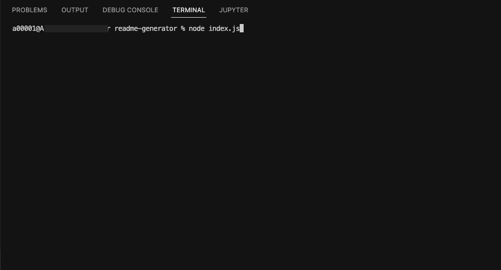
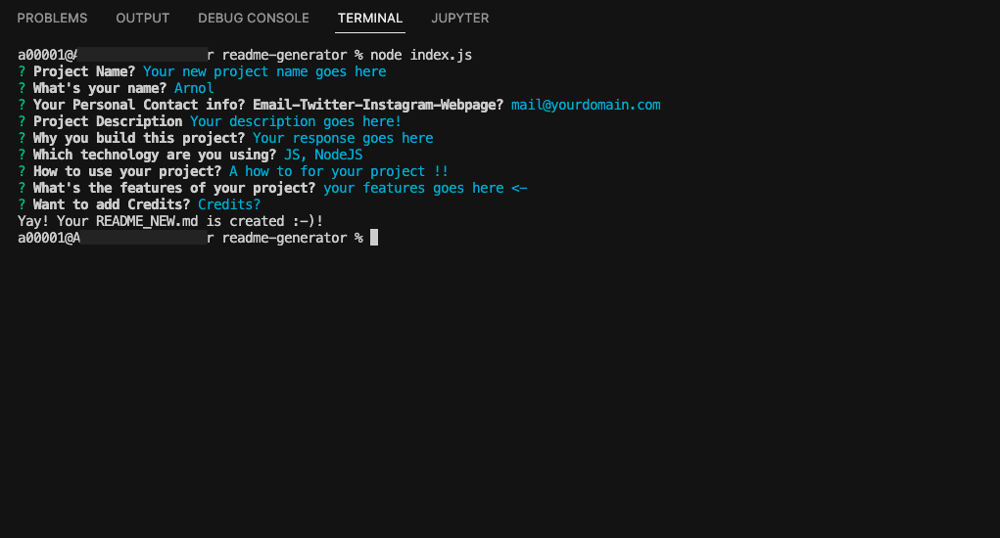
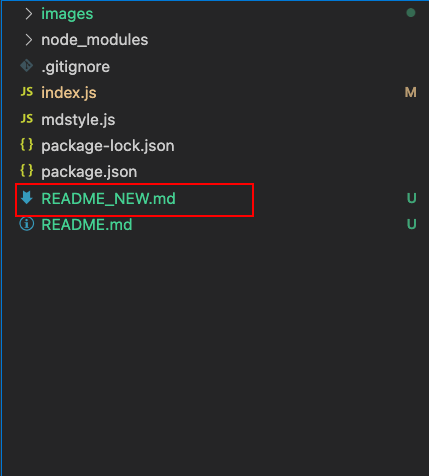

# 📌 README.md Generator
================================

## 🚻 -> Author:  
                __Arnol Segovia__
## ℹ️ -> Contact: 
                  25sparnol@gmail.com
## 🎒 -> GitHub: 
                  https://github.com/aspzs                  
                  
# Table of contents
1. [Description](#description)
2. [Why this project is here?](#why)
3. [Howto](#howto)
4. [Features](#features)
5. [Credits](#credits)

# 📠Description 
----------------	
This project is a README.md generator that gonna ask you some questions about the new project you gonna do, so the final document will be displayed with your responses in a professional and cool way. 

# ❔❔ Why this project is here? 
-------------------------------
  This project was build for saving some time doing a README.md file, as a user you need to fill some questions and the program will be executed with your responses about the project. 
        **🧩 -> Technologies** 
          JS,NodeJS

# 🤹‍♀️ This is a how to for the project :-) 
-----------------------------------------
###      ->  
            Need to clone this project, inside your folder open your terminal and run -> node index.js <- automatically will be display the first  question that is - Project Name? and when you finish responding the questions  press enter for the next question and so on. At the final of the project you need to watch a message displayed on your terminal "Yay! Your README_NEW.md is created :-)!"  and  you can find the file in your main folder. 

Video: https://drive.google.com/file/d/1D16OiF-07yT91LCB8Yrwtwu6ZaSFX2nk/view
      
# 🚀 Features: 
--------------
      ->  
            Specific questions about a new project, and a funny/cool style that will display your responses, meanwhile is a faster and easy way to create a new REAME.md file

## 🛠 Credits: 
### Arnol Segovia

------------------
<3 Thank you :-)
------------------

